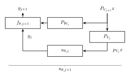
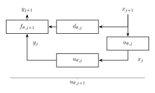

# UNet

Considérons $(x, y) \in L^2 \times L^2$ ou $L^2$ est le Hilbert $L^2(\R^d)$ (ou éventuellement $L^2([0, 1]^d)$) et intéressons nous au problème de régression

$$min_{\theta} \mathbb{E} \left[ l(f_\theta(x), y) \tag{P1} \right]$$

pour une fonction de perte $l$ donnée et une famille paramétrique $\set{f_\theta}$.

Faisons alors l'hypothèse de modélisation de l'extistence et la connaissance d'une **approximation multirésolution (MRA)** $V_0 \subset V_1 \subset \dots \subset L^2$ [[c.f. Annexe]](#annexe) dans lequel le problème $(P1)$ se décompose "bien", c'est à dire que la convergence suivante est "très rapide" : 

$$\mathbb{E} \vert\vert f_\theta(P_{V_j} x) - y \vert\vert^2 \to 0$$

_Remarquons que le résultat, différent, $\mathbb{E} \vert\vert P_{V_j} y - y \vert\vert^2 \to 0$ est bien connu, il dépend de la loi de $y$ et de sa régularité mais est assez facilement accessible._

_Un modèle concret que l'on peut imaginer est celui de la reconstruction de $y$, en prenant $x = y + \epsilon$ où $\epsilon$ est un bruit gaussien et $l$ la perte quadratique c'est un modèle BBG [[c.f. Estimation Non Paramétrique I. Castillo]](https://perso.lpsm.paris/~castillo/np/np.html)._

Notons $W_{j+1}$ le complémentaire de $V_j$ dans $V_{j+1}$ de sorte que $V_{j+1} = W_{j+1} \oplus V_j$.

Sous cette hypothèse, on peut s'inspirer du boosting [[c.f. Introduction to Machine Learning, M. Sangnier]](https://perso.lpsm.paris/~msangnier/files/mlM2/notes_student.pdf) et envisager de construire un apprenant (ou approximateur, ou estimateur) de manière récursive.

1. Estimer $y \vert P_{V_0} x$ avec $f_{\theta, 0}(P_{V_0}x)$
2. Estimer $y \vert (P_{W_1} x, y \vert P_{V_0} x)$ avec $f_{\theta, 1}(P_{W_1}x, f_{\theta, 0}(P_{V_0}x))$
3. Etc.

On envisage pas pour le moment de chercher une solution explicite à ce problème mais simplement de justifier le choix d'une structure réseau.

_Notons qu'il serait intéressant d'exprimer, et si possible expliciter, la solution à ce problème dans le cadre d'apprenants très simple. Bien qu'on ait pas poursuivit cette démarche, une recherche dans cette direction nous a mené à la [[méthode de Viola et Jones]](https://en.wikipedia.org/wiki/Viola%E2%80%93Jones_object_detection_framework) qui applique exactement le boosting dans ce cadre._

> _Viola–Jones is essentially a boosted feature learning algorithm, trained by running a modified AdaBoost algorithm on Haar feature classifiers to find a sequence of classifiers $f_{1},f_{2},...,f_{k}$. Haar feature classifiers are crude, but allows very fast computation, and the modified AdaBoost constructs a strong classifier out of many weak ones._

#### Algorithme de transformée en ondelettes rapide

Dans l'optique d'appliquer une telle procédure il nous faudrait un moyen de décomposer la fonction $x$ dans la base d'ondelette associée à la MRA connue. Il existe un tel algorithme, c'est la **transformée en ondelettes rapide**. Cet algorithme de [banc de filtres](https://en.wikipedia.org/wiki/Filter_bank) calcul les coefficients d'ondelettes d'une fonction échantillonée à résolution finie $j$ en décomposant récursivement chaque approximation $P_{V_{j + 1}} x$ en une approximation plus grossière $P_{V_j} x$ et les coefficients d'ondelettes portés par $P_{W_{j + 1}} x$.

_Voir l'[annexe](#annexe) pour une explication plus détaillée de la MRA et de cette procédure._

Cet algorithme repose sur le résultat suivant, appliqué récursivement.

Notons $\phi$ la fonction d'échelle et $\psi$ l'ondelette (qui caractérisent la MRA) et notons $h$ et $g$ les filtres correspondants (qui eux même caractérisent $\phi$ et $\psi$).

Pour $x \in L^2$ notons $a_j[k] = \langle x, \phi_{j, k} \rangle$ et $d_j[k] = \langle x, \psi_{j, k} \rangle$ les coefficients des projections de $x$.

On peut montrer que ces coefficient sont calculable par une récursion de convolutions discrètes et de sous-échantillonages, c'est à dire que

$$
\begin{align*}
a_j[k] &= \underset{k' \in \Z}{\sum} h[k' - 2k] a_{j+1}[k] \\
d_j[k] &= \underset{k' \in \Z}{\sum} g[k' - 2k] d_{j+1}[k]
\end{align*}
$$

_Les termes de $h$ et $g$ non nuls correspondent au support de la fonction d'échelle, ils sont en nombre fini dès lors que celle-ci est a support compact, ce qui sera toujours le cas en pratique._

Un schéma de l'algorithme récursif est donné par 

Il faut alors constaté qu'en prenant les fonctions d'approximation $f_{\theta, j}$ paramétrées par des convolution, relu, upsample on retrouve la structure d'un réseau UNet dont l'encodeur est non appris mais fixé par le choix de base d'ondelette.

#### Cas de l'approximation multirésolution inconnue

Le choix de base d'ondelette (ou d'approximation multirésolution de manière équivalente) est donc un à priori de modélisation. En s'inspirant des résultats de décennies de recherche en traitement du signal, et en particulier appliqué à différents domaines (audio, vision, etc), il semble possible de faire des choix raisonnablement éclairés. Cependant, on peut affaiblir notre hypothèse et ne pas considérer une telle base connue, on est naturellement menés à penser à chercher à l'estimer.

On peut alors se référer à deux autres résultat d'approximation multirésolution dûs à Mallat, Meyer, et Lemarié [[c.f. A Wavelet Tour of Signal Processing, Mallat]](https://doi.org/10.1016/B978-0-12-374370-1.X0001-8). D'une part la MRA est entièrement caractérisée par la fonction d'échelle, qui est elle-même complètement caractérisée par la suite $h$, appelée **filtre miroir conjuguée**. D'autre part en se restreignant aux ondelettes orthogonales de support compact, le choix de $h$ caractérise l'ondelette.

Par conséquent si l'on à pas connaissance de la base d'ondelette, il est suffisant de paramétrer les filtres $h$ et $g$ dans la cascade de l'algorithme de transformée en ondelette rapide pour être capable d'approximer la décomposition en n'importe quelle base. L'apprentissage de la base se ferait alors par descente de gradient stochastique en parallèle de l'apprentissage des apprenants $f_{\theta, n}$.

Finalement on abouti à une fonction paramétrique dont le schéma est le suivant, si proche de celui d'un UNet qu'il est impossible de ne pas faire l'interprétation suivante.

#### Interprétation de l'architecture UNet

On peut voir un UNet (son décodeur) comme une version apprise d'une décomposition en ondelettes. A contrario d'un décomposition en ondelette fixée, le UNet apprend la base optimale pour résoudre le problème de régression $(P1)$.

L'encodeur agit comme une récursion de projections dans des espaces d'approximation de plus en plus grossier en extrayant les basses fréquences (approximations) des hautes fréquences (détails).

Les basses fréquences, parcimonieuses, sont envoyées au bottleneck $f_{\theta, 0}$ pour être traitées sémantiquement (espace latent).

Les hautes fréquences, sont transmises au décodeur par skip-connexion pour préconditionner la reconstruction à plus haute résolution (un prior spatial régularisant l'upsampling du décodeur).

#### Cas de la diffusion

Dans le cas de la diffusion, un pas (discret) du processus backward s'écrit $x_t = \sqrt{\bar{\alpha}_t} x_0 + \sqrt{1 - \bar{\alpha}_t} \epsilon$ où $\epsilon \sim \mathcal{N}(0, 1)$. Si on projette dans une base d'ondelettes orthonormale alors les $w_n = \langle \epsilon, e_n \rangle$ sont toujours des gaussiennes centrée réduite et indépendantes. Et on retrouve un modèle de bruit blanc gaussien.

Or on sait que dans un tel modèle, sous les bonnes hypothèses (d'$\alpha$-holderité par exemple) l'erreur est d'ordre $\vert \vert x - P_{e_n} x \vert \vert^2 \lesssim 2^{-2 \alpha n}$.

Ici l'hypothèse d'une "bonne" MRA est donc satisfaire (induite des hypothèses de la diffusion)

#### _WIP_ Lien avec les ODE 

Il est possible de partager une remarque supplémentaire, que l'on a pas étudié en profondeur mais qui ouvre des portes intéressantes.

La FWT applique récursivement les même filtres $h$ et $g$, tandis que le UNet n'est pas contraint à apprendre les même paramètres à chaque couche, il peut être intéressant de se demander ce qui peut se produire si l'on introduit cette contrainte.

L'interprétation dans le même cadre que ce que l'on a présenté jusque ici est assez simple : on fait une _vrai_ décomposition dans une base inconnue (apprise) (en omettant le fait que les contraintes techniques pour que $h$ et $g$ soient en effet des filtres associé à une base d'ondelette _orthogonale_ n'ont pas de raison particulière d'être respectées, juste l'intuition qu'une base orthogonales permet une reconstruction parfaite tandis qu'une mal choisie entraine une perte d'information rendant cette reconstruction imparfaite).

Cependant il est possible d'approcher le problème sous l'angle des ODE.

Dans un resnet on a $x_{t+1} = x_t + f(x_t, \theta_t)$, si on impose la contrainte d'un même paramètre on a donc $x_{t+1} = x_t + f(x_t, \theta)$. En faisant tendre le pas vers $0$ (i.e. en prenant un réseau infiniment profond) on obtient la discrétisation d'euler d'une equation différentielle $\frac{dx(t)}{dt} = f(x(t), t, \theta)$. 

Si l'on applique cette démarche à notre cas on a plutôt affaire à un processus de diffusion sur une échelle d'espace. Le paramètre de temps $t$ est ici un paramètre d'échelle $\sigma$, et l'équation différentielle décrit comment l'image évolue lorsque l'on va d'un approximation fine à grossière (ou plus intéressant : l'inverse). Ca miroir l'équation

$$\frac{\partial x}{\partial \sigma} = \nabla^2 x$$

Si le filtre appris agit comme la dérivée seconde.

## Annexe

#### Introduction à l'analyse multi-résolution et justification des résultats

Etant donnée le cadre que fourni l'approximation multirésolution pour l'analyse des UNet, nous allons faire une introduction de cette théorie. Trois objectifs nous intéressent en particulier :

1. Introduire les termes pour donner un cadre suffisament formel
2. Etablir l'équivalence de caractérisation entre MRA, base d'ondelette orthogonale, et filtre mirroir conjugué
3. Introduire l'algorithme de transformée en ondelettes rapide

La présentation faite ici se base sur le livre [A Wavelet Tour of Signal Processing](https://doi.org/10.1016/B978-0-12-374370-1.X0001-8) de Mallat (particulièrement le chapitre 7, et en moindre mesure les chapitres 4 et 5). Bien que ce ne soit pas notre sujet mentionnons pour la complétion que ce travail de Mallat accorde aussi beaucoup de soin à des caractérisations et contraintes permettant la construction aisée de filtres et bases d'ondelettes.

---

**L'approximation multirésolution** constitue l'approximation des fonctions de $L^2(\R)$ à diverses résolutions en les projetants orthogonalement sur une suite de sous espaces emboités $(V_j)$ (dits d'approximation à résolution $j$). L'approximation d'une fonction $f \in L^2(\R)$ à résolution $2^j$ est spécifiée par une suite d'échantillons fournissant une moyenne locale de $f$ sur des voisinages de taille $2^{-j}$.

L'interêt est très appliqué : adapter la résolution d'une fonction permet de ne tenir compte que des détails nécessaires à une certaine tache.

On peut montrer que l'analyse multirésolution est entièrement caractérisée par un filtre dicret (i.e. une suite servant de noyau à une convolution discrète) qui détermine par ailleurs la perte d'information entre résolutions.

On va commencer par définir un peu rigoureusement la notion d'approximation multirésolution, puis faire la construction des bases d'ondelettes orthogonales.

Une **analyse multi-résolution (MRA)** de $L^2(\R)$ est la donnée d'une suite de sous espaces emboités $(V_j)$, $j \in \Z$, vérifiants :

1. $V_j \subset V_{j+1}$
2. $f \in V_j  \iff f(2 \cdot) \in V_{j+1}$
3. $f \in V_0  \iff f(\cdot - k) \in V_0 ,\ \forall k \in \Z$
4. $\underset{j \in \Z}{\bigcap} V_j = \set{0}$ et $\underset{j \in \Z}{\bigcup} V_j$ dense dans $L^2(\R)$
5. Il existe une $\phi \in V_0$ telle que $\set{\phi_k := \phi( \cdot - k) }_{k \in \Z}$ est une base orthonormale de $V_0$. $\phi$ est appelée **fonction échelle** (ou éventuellement ondelette père).

$\phi$ peut s'interpréter comme un pixel dans la résolution donnée.

L'hypothèse 4. garantie que tendre vers $-\infty$ mène à perdre tous détail, tandis que tendre vers $+\infty$ approche la fonction originale $f$ : $\underset{j \to \infty}{\lim} {\vert\vert f - P_{V_j} f \vert\vert} = 0$. _Il est par ailleurs possible de lier la vitesse de convergence à la régularité lipshitz de $f$._

Remarquons tout de suite que le sous espace $V_j$ est engendré par une base orthonormale consituée de $\set{\phi_{j, k} := 2^{j / 2}\phi(2^j \cdot - k) }_{k \in \Z}$.

En conséquence l'approximation d'une fonction $f \in L^2(\R)$ à résolution $j$, qui est définie comme la projection orthogonale de $f$ sur $V_j$, s'obtient par expansion dans cette base : en notant $a_j[k] = \langle f, \phi_{j, k} \rangle$ on a $P_{V_j} f = \underset{k}{\sum} a_j[k] \phi_{j, k}$.

###### Exemple : Approximation multirésolution constante par morceau

Un exemple simple et intuitif d'approximation multirésolution est composée par les fonctions constantes par morceaux. L'espace d'approximation $V_j$ est l'ensemble des fonctions constante sur les intervalles $[\frac{k}{2^j}, \frac{k+1}{2^j})$, l'approximation de $f \in L^2(\R)$ à résolution $j$ est la projection sur ces fonctions constantes, et la fonction d'échelle est la fenêtre $\mathbb{1}_{[0, 1)}$.

#### Caractérisation de l'approximation multirésolution par filtre mirroir conjugué

Une approximation multirésolution est entièrement caractérisée par la fonction d'échelle $\phi$, qui génère une base orthogonale de chaque espace $V_j$. 

_Il est possible d'étudier les propriétée de $\phi$ qui garantissent que les espaces $(V_j)$ satisfont toutes les conditions d'une approximation multi-résolution, c'est utile entre autres pour la construction de tels approximations._ 

Il est également possible de prouver que toute fonction échelle est caractérisée par un filtre discret (appelé **filtre miroir conjugué**), c'est ce qui nous intéresse ici.

###### Equation de dilatation

En effet, il existe une suite $h[k]$ telle que 

$$\phi(x) = \sqrt{2} \underset{k \in \Z}{\sum} h[k] \phi(2 x - k)$$

avec $h[k] = \langle \phi, \sqrt(2) \phi(2 \cdot - k) \rangle$

_Schéma de preuve : Il suffit de voir que $\phi \in V_0 \subset V_1$ et que $\set{\phi_{1, k}}$ est base de $V_1$._

Cette suite $h[k]$ s'interprète donc comme un filtre discret.

La caractérisation d'une fonction échelle par le filtre $h$ est dûe à une théorème de Mallat et Meyer dont la preuve un peu longue peut être trouvée page 310.

**Théorème** : Considère $\phi \in L^2(\R)$ une fonction échelle intégrable. La série de Fourier de $h[k] = \langle \phi, \sqrt{2} \phi(2 \cdot - k) \rangle$ satisfait 

$$
\begin{align*}
\forall \omega \in \R \quad \vert \hat{h}(\omega) \vert^2 + \vert \hat{h}(\omega + \pi) \vert^2 &= 2 \tag{1} \\
\hat{h}(0) &= \sqrt{2} \tag{2}
\end{align*}$$

Réciproquement, si $\hat{h}$ est $2\pi$-périodique et continuement différentiable sur un voisinage de $0$, si elle satisfait les deux points précédents, et si $\underset{\omega \in [-\pi / 2, \pi / 2]}{\inf} \vert \hat{h} \vert > 0$ alors 

$$\hat{\phi}(\omega) = \prod_{j \ge 1} \frac{\hat{h}(2^{-j}\omega)}{\sqrt{2}}$$

est la transformée de Fourier d'une fonction d'échelle $\phi \in L^2(\R)$.

En particulier, les filtres $h$ qui respectent la condition $(1)$ sont appelées **filtres miroirs conjugués**.

#### Lien avec les bases d'ondelette orthogonales

Le role des ondelette est de porter les détails nécessaire à l'augmentation de résolution d'un approximation de $f$. 

Plus formellement, on sait que $V_j \subset V_{j+1}$, notons $W_j$ le supplémentaire de $V_j$ dans $V_{j+1}$ : $V_{j+1} = V_j \oplus W_j$. Puis décomposons la projection de $f$ sur $V_{j+1}$ : $P_{V_{j+1}} f = P_{V_j} f + P_{W_j} f$. 

On interprète $P_{W_j} f$ comme les détails de $f$ qui apparaissent à échelle $j+1$ mais disparaissent à échelle $j$.

On peut prouver qu'il est possible de construire une base orthonormale de $W_j$ en dilatant et translatant une ondelette $\psi$ caractérisée par le filtre miroir conjugué. La preuve peut être trouvée page 320.

Considèrons la fonction d'échelle \phi et $h$ le filtre mirroir conjugué associé. Notons \psi la fonction dont la transformée de Fourier s'écrit

$$\hat{\psi}(\omega) = \frac{1}{\sqrt{2}} \hat{g}(\frac{w}{2}) \hat{\phi}(\frac{w}{2})$$

où 

$$\hat{g} = e^{-i\omega} \hat{h}^*(\omega + \pi)$$

En notant $\psi_{j, k} = \frac{1}{\sqrt{2^j}} \psi(\frac{t - 2^jk}{2^k})$ pour toute échelle $j$ $\set{\psi_{j, k}}_{k \in \Z}$ est une base orthonormale de $W_j$ et $\set{\psi_{j, k}}_{j, k \in \Z}$ est une base orthonormale de $L^2(\R)$.

Par ailleurs on peut lier $g$ à $h$ par la relation $g[k] = (-1)^{1 - k}h[1 - k]$.

Ce théorème nous dit qu'il est possible de construire une base orthonormale d'ondelettes orthonormales à partir d'un filtre miroir conjugué. On pourrait se demander si réciproquement toute base d'ondelettes orthogonale est associée à une MRA et un filtre miroir conjugué. Si l'on impose que $\psi$ ait support compact, Lemarié a en effet prouvé que $\psi$ correspond à une MRA. [[Les ondelettes en 1989, Lecture Notes in Mathematics 1438, P.G.Lemarié ed.]](https://math.maths.univ-evry.fr/lemarie/publi/mypp.html)

#### Support compact

_WIP_

#### MRA multidimensionelle

_WIP_

#### Transformée en ondelette rapide

Cet algorithme de banc de filtres calcul les coefficients d'ondelettes d'une fonction échantillonée à résolution finie $j$.

L'algorithme de transformée en ondelettes rapide décompose récursivement chaque approximation $P_{V_{j + 1}} f$ en une approximation plus grossière $P_{V_j} f$ et les coefficients d'ondelettes portés par $P_{W_{j + 1}} f$. 

Dans l'autre direction la transformée en ondelettes inverse rapide reconstruit chaque $P_{V_{j + 1}} f$ à partir de $P_{V_j} f$ et $P_{W_{j + 1}} f$. 

On va noter $a_j[k] = \langle f, \phi_{j, k} \rangle$ et $d_j[k] = \langle f, \psi_{j, k} \rangle$ les coefficients des projections de $f$.

On va montrer que ces coefficient sont calculable par une récursion de convolutions discrètes et de sous-échantillonages, c'est à dire que

$$
\begin{align*}
a_j[k] &= \underset{k' \in \Z}{\sum} h[k' - 2k] a_{j+1}[k] \\
d_j[k] &= \underset{k' \in \Z}{\sum} g[k' - 2k] d_{j+1}[k]
\end{align*}
$$

et 

$$
a_{j+1}[k] = 
\underset{k' \in \Z}{\sum} h[k - 2k'] a_j[k']
+ \underset{k' \in \Z}{\sum} g[k - 2k'] d_j[k']
$$

_Schéma de preuve : décomposer $\phi_{j, k}$ dans la base, écrire le produit scalaire comme intégral, changer de variable, repasser en porduit scalaire pour identifier._

Ce résultat donne assez directement l'algorithme récursif de transformée en ondelette.

_Schéma de l'étape de décomposition : récursivement, on applique les filtres $h$ et $g$, puis on sous-échantillone par 2._

## Références

- [A Unified Framework for U-Net Design and Analysis, C. Williams, F. Falck](https://arxiv.org/pdf/2305.19638)
- [U-Net: Convolutional Networks for Biomedical Image Segmentation, O. Ronneberger, P. Fischer, T. Brox](https://arxiv.org/pdf/1505.04597)
- [A Wavelet Tour of Signal Processing, Mallat](https://doi.org/10.1016/B978-0-12-374370-1.X0001-8)
- [Neural Ordinary Differential Equations, R. T. Q. Chen, Y. Rubanova, J. Bettencourt](https://arxiv.org/pdf/1806.07366)
- [Estimation Non Paramétrique I. Castillo](https://perso.lpsm.paris/~castillo/np/np.html)
- [Introduction to Machine Learning, M. Sangnier](https://perso.lpsm.paris/~msangnier/files/mlM2/notes_student.pdf)